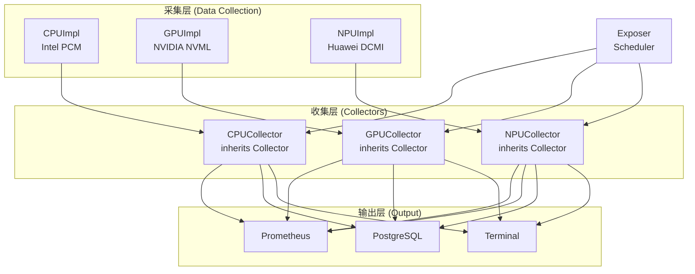

# HwGauge

HwGauge is a lightweight hardware power-consumption exporter that exposes **CPU, GPU and NPU energy metrics as Prometheus Or PostgreSQL Gauges**.
It is implemented in modern C++ to provide **high-performance monitoring with minimal overhead**.


## ✨ Features

* 🖥️ **CPU Monitoring** — Intel PCM (Processor Counter Monitor)
* 🎮 **GPU Monitoring** — NVIDIA NVML (CUDA Toolkit required)
* 🧠 **NPU Monitoring** — Ascend NPU (DCMI required)
* 📡 **Prometheus Exposer** — Built-in HTTP server with configurable endpoint
* 🗄️ **PostgreSQL Storage** — Store metrics in PostgreSQL for long-term retention
* ⚙️ **Template-based Collector Framework** — clean separation of metrics & hardware backends
* 🔌 **Unified Database Interface** — Support multiple storage backends with common API

---

## ⚙️ Architecture Diagram

---

## 📦 Prerequisites

| Requirement        | Notes                                                              |
| ------------------ | ------------------------------------------------------------------ |
| CMake ≥ 3.25       | Required for building                                              |
| C++17 compiler     | GCC / Clang / MSVC                                                 |
| CUDA Toolkit       | Required for NVML GPU monitoring                                   |
| NPU SDK/Driver     | Required for NPU monitoring                                        |
| prometheus-cpp     | Prometheus client development library(for Prometheus module)|
| libpq-dev          | PostgreSQL client development library (for SQL module)             |
| PostgreSQL Server  | PostgreSQL server for storing metrics (optional)                   |
| Root privileges    | Needed to access hardware registers (PCM)                          |

**模块依赖说明:**
- **Prometheus模块**: 需要安装Prometheus C++客户端库，配置见 `vendors/prometheus-cpp/`
- **PostgreSQL模块**: 需要安装libpq-dev和PostgreSQL服务器

---

## 🚀 Installation & Build

### 1️⃣ Clone repository (include submodules)

```bash
git clone https://github.com/X1ngChui/HwGauge.git --recursive
cd HwGauge/
```

### 2️⃣ Intel PCM Patch (optional but recommended)

Due to a submodule conflict, choose one of the following:

**Option A — Patch PCM tests (recommended)**
Edit `vendors/pcm/CMakeLists.txt` and comment/remove:

```
add_subdirectory(tests)
```

**Option B — Disable PCM entirely**

```bash
-DHWGAUGE_USE_INTEL_PCM=OFF
```

---

### 3️⃣ Build

```bash
mkdir build && cd build
cmake ..
cmake --build . --parallel
```

---

## ⚙️ CMake Configuration Options

| Option                  | Default | Description                  |
| ----------------------- | ------- | ---------------------------- |
| `HWGAUGE_USE_INTEL_PCM` | `OFF`    | Enable Intel CPU collectors  |
| `HWGAUGE_USE_NVML`      | `OFF`    | Enable NVIDIA GPU collectors |
| `HWGAUGE_USE_NPU`       | `OFF`    | Enable Ascend NPU collectors |
| `HWGAUGE_USE_PROMETHEUS` | `OFF`  | Enable Prometheus exporte|
|`HWGAUGE_USE_POSTGRESQL`|`OFF`|Enable PostgreSQL storage|

Disable collectors you don't need to reduce dependencies.


---

## ▶️ Usage

After building, the binary is available in `bin/`.

### Run exporter (sudo required)

```bash
chmod +x bin/hwgauge
sudo ./bin/hwgauge [OPTIONS]
```

### Command-line options
```bash
sudo ./bin/hwgauge --help
```

---

## 📊 Exported Prometheus Metrics

### 🖥️ CPU (Intel PCM)

| Metric                        | Unit | Description              |
| ----------------------------- | ---- | ------------------------ |
| `cpu_utilization_percent`     | %    | CPU utilization          |
| `cpu_frequency_mhz`           | MHz  | Current frequency        |
| `cpu_c0_residency_percent`    | %    | Active state residency   |
| `cpu_c6_residency_percent`    | %    | Deep sleep residency     |
| `cpu_power_usage_watts`       | W    | CPU power draw           |
| `memory_read_bandwidth_mbps`  | MB/s | Memory read throughput   |
| `memory_write_bandwidth_mbps` | MB/s | Memory write throughput  |
| `memory_power_usage_watts`    | W    | Memory power consumption |

---

### 🎮 GPU (NVIDIA NVML)

| Metric                           | Unit | Description      |
| -------------------------------- | ---- | ---------------- |
| `gpu_utilization_percent`        | %    | Core utilization |
| `gpu_memory_utilization_percent` | %    | VRAM utilization |
| `gpu_frequency_mhz`              | MHz  | Core clock       |
| `gpu_memory_frequency_mhz`       | MHz  | Memory clock     |
| `gpu_power_usage_watts`          | W    | Power draw       |

---

### 🧠 NPU（华为 Ascend）

| Metric                                 | Unit  | Description              |
| -------------------------------------- | ----- | ------------------------ |
| `npu_aicore_utilization_percent`       | %     | NPU AICore 利用率        |
| `npu_aicpu_utilization_percent`        | %     | NPU AICPU 利用率         |
| `npu_memory_utilization_percent`       | %     | NPU 内存利用率           |
| `npu_aicore_frequency_mhz`             | MHz   | NPU AICore 频率          |
| `npu_aicpu_frequency_mhz`              | MHz   | NPU AICPU 频率           |
| `npu_mem_frequency_mhz`                | MHz   | NPU 内存频率             |
| `npu_power_watts`                      | W     | NPU 功耗                 |
| `npu_health`                           | -     | NPU 健康状态             |
| `npu_temperature_celsius`              | °C    | NPU 温度                 |
| `npu_voltage_volts`                    | V     | NPU 电压                 |

---
