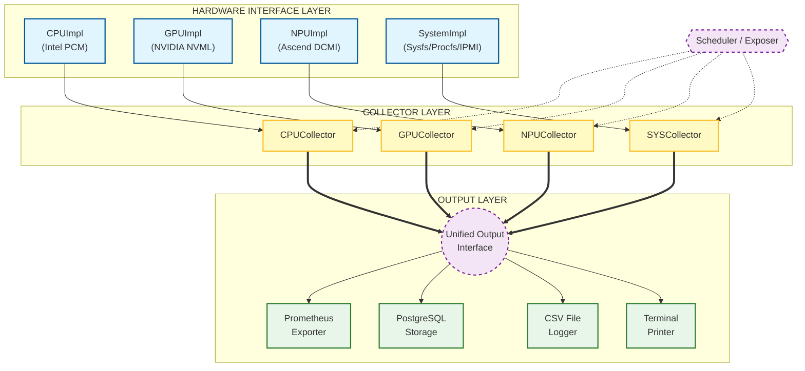

# HwGauge

HwGauge is a lightweight hardware power-consumption exporter that exposes **CPU, GPU and NPU energy metrics as Prometheus Gauges, PostgreSQL records, or CSV logs**.
It is implemented in modern C++ to provide **high-performance monitoring with minimal overhead**.

## ✨ Features

* 🖥️ **CPU Monitoring** — Intel PCM (Processor Counter Monitor)
* 🎮 **GPU Monitoring** — NVIDIA NVML (CUDA Toolkit required)
* 🧠 **NPU Monitoring** — Ascend NPU (DCMI required)
* 📊 **System Monitoring** — RAM, Disk I/O, Network, and Chassis Power (Linux /proc & sysfs)
* 📡 **Prometheus Exposer** — Built-in HTTP server with configurable endpoint
* 🗄️ **PostgreSQL Storage** — Store metrics in PostgreSQL for long-term retention
* 📝 **CSV Logger** — Export metrics to CSV files for offline analysis
* ⚙️ **Template-based Collector Framework** — clean separation of metrics & hardware backends
* 🔌 **Unified Database Interface** — Support multiple storage backends with common API

---

## ⚙️ Architecture Diagram

---

## 📦 Prerequisites

| Requirement        | Notes                                                              |
| ------------------ | ------------------------------------------------------------------ |
| CMake ≥ 3.25       | Required for building                                              |
| C++17 compiler     | GCC / Clang / MSVC                                                 |
| CUDA Toolkit       | Required for NVML GPU monitoring                                   |
| NPU SDK/Driver     | Required for NPU monitoring                                        |
| prometheus-cpp     | Prometheus client development library(for Prometheus module)|
| libpq-dev          | PostgreSQL client development library (for SQL module)             |
| PostgreSQL Server  | PostgreSQL server for storing metrics (optional)                   |
| Sudo privileges    | Needed to access hardware registers (PCM)                          |
---

## 🔧 System Setup
To ensure full functionality of system metrics, specific kernel modules and tools are required.

### 1. CPU Temperature (`coretemp`)
Used to read CPU temperatures via `/sys/class/hwmon`.

```bash
# 1. Install kernel module extras (fixes modprobe errors on some distros)
sudo apt-get install linux-modules-extra-$(uname -r)
# 2. Load the module
sudo modprobe coretemp
# 3. Verify (should list temp inputs)
ls /sys/class/hwmon/hwmon*/temp*_input
```

### 2.System Power(`ipmitool or lm-sensors`)
Ensure your machine has a valid DCMI or a power-related sensor
```bash
# 1. Install tools
sudo apt-get update
sudo apt-get install ipmitool lm-sensors
# 2. Load IPMI modules (if not auto-loaded)
sudo modprobe ipmi_devintf
sudo modprobe ipmi_si
# 3. Power Reading Verification
sudo ipmitool dcmi power reading #Standard DCMI (Recommended):
sudo ipmitool sdr elist | grep -iE "Pwr|Power" #Legacy/Vendor Specific
```

### 3.Intel CPU Counters (msr)
Required for Intel PCM (CPU monitoring) to access model-specific registers.
```bash
sudo modprobe msr
```


## 🚀 Installation & Build

### 1️⃣ Clone repository (include submodules)

```bash
git clone https://github.com/X1ngChui/HwGauge.git --recursive
cd HwGauge/
```

### 2️⃣ Intel PCM Patch (optional but recommended)

Due to a submodule conflict, choose one of the following:

**Option A — Patch PCM tests (recommended)**
Edit `vendors/pcm/CMakeLists.txt` and comment/remove:

```
add_subdirectory(tests)
```

**Option B — Disable PCM entirely**

```bash
-DHWGAUGE_USE_INTEL_PCM=OFF
```

---

### 3️⃣ Build

```bash
mkdir build && cd build
cmake ..
cmake --build . --parallel
```

---

## ⚙️ CMake Configuration Options

| Option                  | Default | Description                  |
| ----------------------- | ------- | ---------------------------- |
| `HWGAUGE_USE_INTEL_PCM` | `OFF`    | Enable Intel CPU collectors  |
| `HWGAUGE_USE_NVML`      | `OFF`    | Enable NVIDIA GPU collectors |
| `HWGAUGE_USE_NPU`       | `OFF`    | Enable Ascend NPU collectors |
| `HWGAUGE_USE_PROMETHEUS` | `OFF`  | Enable Prometheus exporte|
|`HWGAUGE_USE_POSTGRESQL`|`OFF`|Enable PostgreSQL storage|

Disable collectors you don't need to reduce dependencies.


---

## ▶️ Usage

After building, the binary is available in `bin/`.

### Run exporter (sudo required)

```bash
chmod +x bin/hwgauge
sudo ./bin/hwgauge [OPTIONS]
```

### Command-line options
```bash
sudo ./bin/hwgauge --help
```

---

## 📊 Exported Prometheus Metrics

### 🖥️ CPU (Intel PCM)

| Metric                        | Unit | Description              |
| ----------------------------- | ---- | ------------------------ |
| `cpu_utilization_percent`     | %    | CPU utilization          |
| `cpu_frequency_mhz`           | MHz  | Current frequency        |
| `cpu_c0_residency_percent`    | %    | Active state residency   |
| `cpu_c6_residency_percent`    | %    | Deep sleep residency     |
| `cpu_power_usage_watts`       | W    | CPU power draw           |
| `memory_read_bandwidth_mbps`  | MB/s | Memory read throughput   |
| `memory_write_bandwidth_mbps` | MB/s | Memory write throughput  |
| `memory_power_usage_watts`    | W    | Memory power consumption |
|`cpu_temperature`	            |°C    | CPU temperature|
---

### 🎮 GPU (NVIDIA NVML)

| Metric                           | Unit | Description      |
| -------------------------------- | ---- | ---------------- |
| `gpu_utilization_percent`        | %    | Core utilization |
| `gpu_memory_utilization_percent` | %    | VRAM utilization |
| `gpu_frequency_mhz`              | MHz  | Core clock       |
| `gpu_memory_frequency_mhz`       | MHz  | Memory clock     |
| `gpu_power_usage_watts`          | W    | Power draw       |
|`gpu_temperature`	       |°C	  | GPU temperature|

---

### 🧠 NPU（Ascend DCMI）

| Metric | Unit | Description |
|------|------|-------------|
| `npu_aicore_utilization_percent` | % | AI Core utilization |
| `npu_aicpu_utilization_percent` | % | AI CPU utilization |
| `npu_ctrlcpu_utilization_percent` | % | Control CPU utilization |
| `npu_vector_utilization_percent` | % | Vector Core utilization |
| `npu_memory_utilization_percent` | % | On-chip memory utilization |
| `npu_membw_utilization_percent` | % | Memory bandwidth utilization |
| `npu_aicore_frequency_mhz` | MHz | AI Core frequency |
| `npu_aicpu_frequency_mhz` | MHz | AI CPU frequency |
| `npu_ctrlcpu_frequency_mhz` | MHz | Control CPU frequency |
| `npu_mem_frequency_mhz` | MHz | Memory frequency |
| `npu_memory_total_mb` | MB | Total memory capacity |
| `npu_memory_used_mb` | MB | Used memory capacity |
| `npu_power_watts` | W | NPU chip power consumption |
| `npu_health_status` | - | Health status (0:OK, 1:WARN, 2:ERR, 3:CRIT) |
| `npu_temperature` | °C | NPU chip temperature |
| `npu_voltage_volts` | V | NPU input voltage |

---
### 📊 System (General)

| Metric                              | Unit | Description                         |
|-------------------------------------|------|-------------------------------------|
| `system_memory_total_bytes`           | GB    | Total physical memory               |
| `system_memory_used_bytes`            | GB    | Used physical memory                |
| `system_memory_utilization_percent`   | %    | Memory utilization                  |
| `system_disk_read_bytes_per_sec`      | MB/s  | Total disk read rate                |
| `system_disk_write_bytes_per_sec`     | MB/s  | Total disk write rate               |
| `system_disk_max_utilization_percent` | %    | Utilization of busiest disk         |
| `system_net_download_bytes_per_sec`   | MB/s  | Total network download rate         |
| `system_net_upload_bytes_per_sec`     | MB/s  | Total network upload rate           |
| `system_power_usage_watts`            | W    | Total system power                  |
---
**Note: System power usage is collected asynchronously because IPMI/DCMI hardware queries can have high latency. It may not update as frequently as other metrics.**

